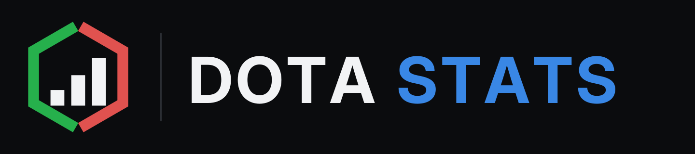
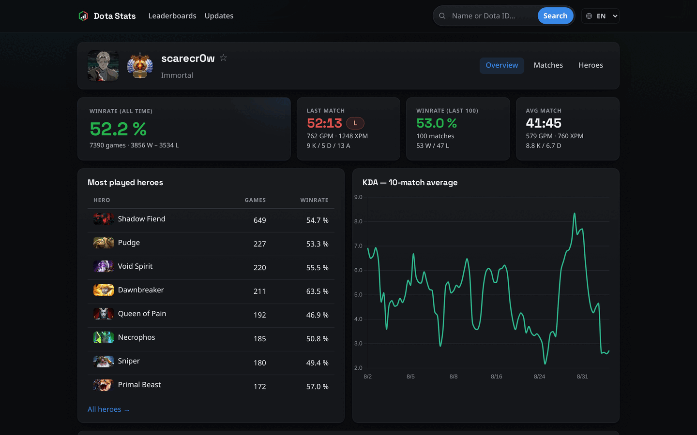
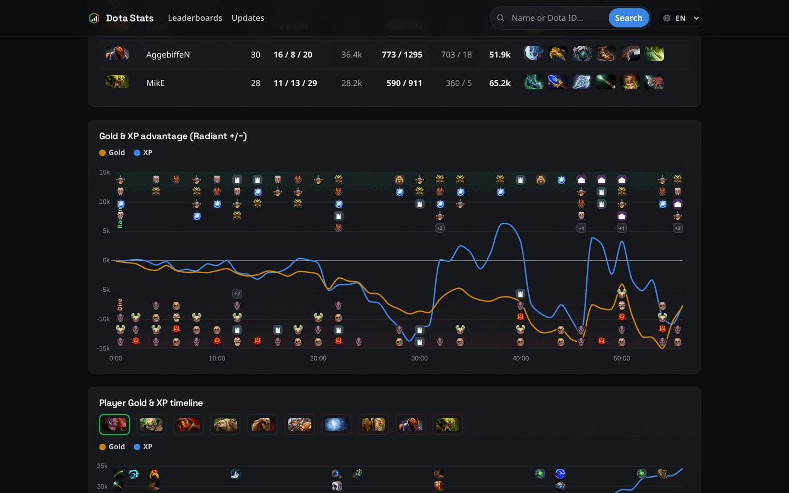
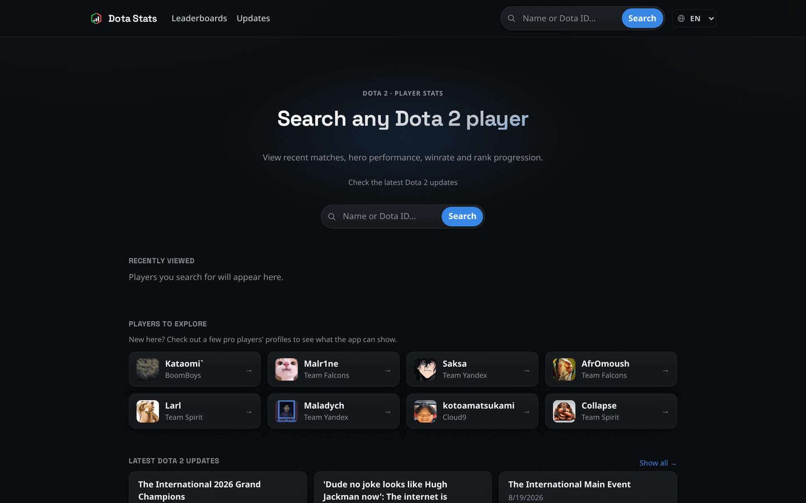
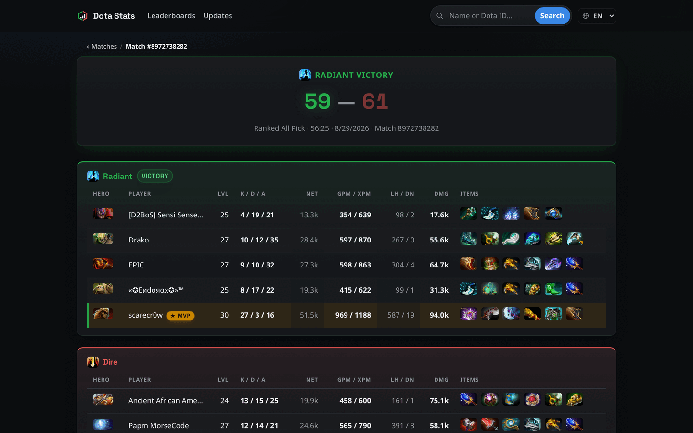
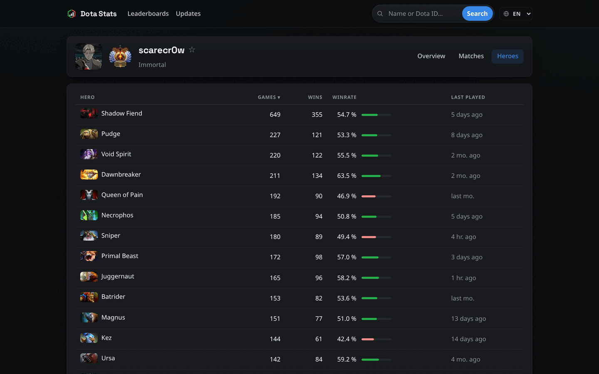
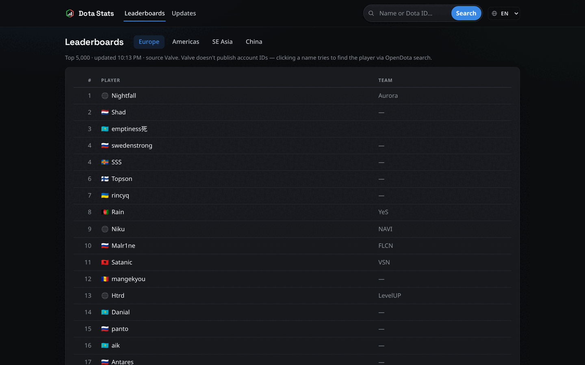

<p align="center">
  <picture>
    <source media="(prefers-color-scheme: dark)" srcset="public/logo/logotext.svg">
    
  </picture>
</p>

<p align="center">
  A personal Dota 2 stats tool — matches, hero winrates, gold/XP graphs and rank progression for any player, straight from the public OpenDota API.
</p>

<p align="center">
  <a href="https://dota-stats-by-keno.vercel.app/"></a>
  
  
  
  
  <a href="./LICENSE"></a>
</p>

<p align="center">
  <b>→ Try it live: <a href="https://dota-stats-by-keno.vercel.app/">dota-stats-by-keno.vercel.app</a></b>
</p>

---

## What is this

A Dotabuff/OpenDota-inspired stats app that gives you a clear view of your own
and other players' Dota 2 games — matches, winrate by hero, match detail
(itemization, gold/XP graph), and trends over time. It's built on top of the
public [OpenDota API](https://docs.opendota.com/), so there's no need to build
a custom replay parser.

It is **frontend-only** — **decision from 2026-07-03: no custom backend**.
Caching is handled by an in-memory cache + localStorage directly in the app.
That also means every request goes straight to the public OpenDota API, so its
rate limits apply and none of the match data is mine — it's Valve's data,
served through OpenDota.

## Screenshots

<p align="center">
  
  <br><em>Player dashboard — all-time and recent winrate, most played heroes, KDA trend</em>
</p>

<p align="center">
  
  <br><em>Gold &amp; XP advantage over time, with kill/tower/Roshan markers and a per-player timeline</em>
</p>

<table>
  <tr>
    <td width="50%">
      <br>
      <em>Home — search any player, recently viewed, latest Dota 2 updates</em>
    </td>
    <td width="50%">
      <br>
      <em>Match detail — full scoreboard with items, KDA, GPM/XPM and MVP</em>
    </td>
  </tr>
  <tr>
    <td width="50%">
      <br>
      <em>Hero stats — sortable games/wins/winrate per hero</em>
    </td>
    <td width="50%">
      <br>
      <em>Leaderboards — official Valve division rankings</em>
    </td>
  </tr>
</table>

<sub>Screenshots use the public profile <a href="https://dota-stats-by-keno.vercel.app/player/156058300">scarecr0w (156058300)</a>.</sub>

## Features

- 📊 **Dashboard** — winrate, rolling-window winrate graph (e.g. a 20-match
  window, so it doesn't swing wildly on a small sample), top heroes,
  GitHub-style activity heatmap for the last year, KDA/GPM/XPM trends, and
  winrate by game mode (All Pick vs Turbo vs Ranked…)
- 📜 **Matches list** — infinite scroll (OpenDota `offset` pagination), filter
  by hero, mode and result
- 🔍 **Match detail** — scoreboard, itemization, gold/XP graph from
  `radiant_gold_adv`, plus a per-player gold/XP timeline with item-purchase
  markers; player names are clickable and link to their profiles
- ⏳ **Automatic replay parsing** — opening an unparsed match (<30 days old)
  requests a parse and the graph fills in via polling; older matches get an
  explanation that the replay has expired
- 🦸 **Hero stats** — sortable winrate/games-per-hero table
- 👤 **Guest mode** — `/player/:accountId` routes with Overview/Matches/Heroes
  tabs, search by name or account ID, no login and no backend required
- 🏠 **Home page** — large search box, "My profile" card, recently viewed
  profiles and favorite players (star toggle on a profile, both stored in
  localStorage)
- 🏆 **Leaderboards** — official Valve division rankings (EU/Americas/SEA/China)
  via `www.dota2.com/webapi`. The endpoint doesn't send CORS headers, so
  dev/preview routes it through a Vite proxy at `/valve` (`vite.config.ts`).
  Valve doesn't expose account IDs, so clicking a player name goes to OpenDota
  search instead
- 📰 **Updates page** — latest Dota 2 patch/news posts via the Steam News API
  (same CORS-proxy pattern as Leaderboards, `/steamnews` in `vite.config.ts`);
  a preview shows on the home page, the full list at `/updates`
- 🌍 **Multi-language support** — `vue-i18n`, 10 languages (English default:
  en, sk, ru, uk, de, pt, es, zh, fil, tr), a switcher in the topbar, and a
  persisted choice (`dotastats:locale`); dates/relative time follow the active
  locale via `Intl`
- 🛡️ **Resilience** — OpenDota requests have a client-side timeout (12s), plus
  a "Refresh from OpenDota" action for players OpenDota hasn't indexed yet

## Getting started

```bash
npm install
npm run dev
```

For your own profile: copy `.env.example` to `.env.local` and set
`VITE_ACCOUNT_ID` (the Friend Code from your Dota profile). Without it the app
runs in guest mode via search.

Other commands: `npm run build` (typecheck via `vue-tsc -b` + Vite build),
`npm run preview` (local preview of the build).

## Tech stack

- **Frontend:** Vue 3 + Vite + TypeScript, Chart.js for charts, vue-router,
  vue-i18n
- **Data:** OpenDota API (public), Steam CDN for hero/item icons, Valve webapi
  for leaderboards
- **Persistence:** localStorage (history, favorites, locale) — no database, no
  backend
- **Hosting:** Vercel

## Structure

- `src/views/` — pages (Dashboard, Matches, MatchDetail, Heroes, Player,
  Search, Home, Leaderboard, Updates, Terms, Privacy)
- `src/components/` — shared components (`WinrateBar`, `TeamGlyph`,
  `LineChart`, `ActivityHeatmap`, `HeroIcon`, `PlayerLinkCard`, `SearchBox`,
  `StatCard`, `Breadcrumb`, `ProductTour`, `RankBadge`, `Skeleton`,
  `TopProgressBar`)
- `src/composables/` — `useAsync`, `useFavorites`, `useRecentPlayers`,
  `useAppLocale`, `useNavProgress`, `useSteamNews`
- `src/api/opendota.ts` — all OpenDota API calls
- `src/i18n/` — `vue-i18n` config and translations (`locales/*.ts`)
- `src/styles/tokens.css` — design tokens (type scale, spacing, radius,
  elevation)
- `src/utils/` — formatting (`format.ts`), stats (`stats.ts`), theme
  (`theme.ts`), account ID/profile-link parsing (`accountId.ts`), Steam
  content helpers (`steamContent.ts`)

<details>
<summary><b>Key OpenDota endpoints</b></summary>

- `GET /players/{account_id}` — profile, rank
- `GET /players/{account_id}/matches` — recent matches
- `GET /players/{account_id}/heroes` — winrate/games per hero
- `GET /players/{account_id}/wl` — win/loss split
- `GET /matches/{match_id}` — match detail (items, gold/XP graph over time)
- `GET /search?q=` — search players by name (can take up to ~7s)
- `POST /request/{match_id}` — request a replay parse; the app sends this
  automatically when opening an unparsed match (<30 days old) and polls for
  the chart data every minute

**Note:** to see detailed match data (items over time, gold/XP graph), you
need `Settings → Advanced Options → Expose Public Match Data` enabled in the
Dota client — otherwise the replay never gets parsed and the API only returns
basic info.

</details>

<details>
<summary><b>Branching model</b></summary>

**Decision from 2026-07-18:** `main` is production (always deployable, what's
live). `dev` is the integration branch — feature/fix branches open PRs into
`dev`, not `main`. `dev` gets merged into `main` periodically as a release
(see `/release`), not on every PR.

```
feat/xxx, fix/xxx  →  PR into dev  →  (later) dev  →  PR into main = release
```

</details>

## Project docs

Changelog: [CHANGELOG.md](./CHANGELOG.md) · Unfinished/planned work:
[TODO.md](./TODO.md) · License: [MIT](./LICENSE)
